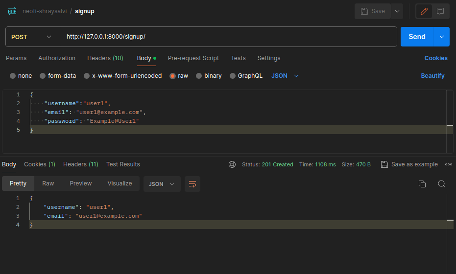
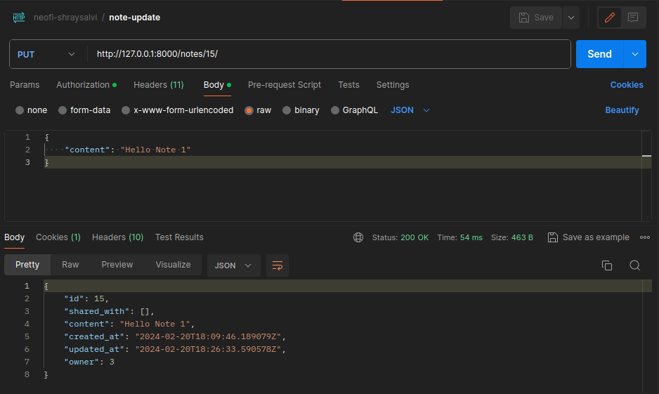

# Neofi Assesment

How to run the code:

1. Use `pip install -r requirements.txt` to install al dependies.
2. Use `python manage.py runserver` in the root directory of the project.

## 1. Authentication

I used django rest framework JWT for authentication and authorisation.

1. **Signup**
   
   1.1. Go to `http://127.0.0.1:8000/signup/` url and use raw in the body section of postman.
   1.2. Provide essential details to signup.
   ```json
    {
        "username":"user1",
        "email": "user1@example.com",
        "password": "Example@User1"
    }
   ```
   1.3. Hit POST request.
    
   1.4. Account Created

2. **Login**

   2.1. Go to `http://127.0.0.1:8000/login/` url and use raw in the body section of postman.
   2.2. Provide essential details to login.
   ```json
    {
        "username":"user1",
        "password": "Example@User1"
    }
   ```
   2.3. Hit POST request.
    
   2.4. You got access and refresh token, copy access token for authentication each time when required.

## 2. Note

We need to add access token in `Bearer` section in Auth that make server understand which user want to access the serer.


1. **Create Note**
   1.1. Only authorised user can create note, go to `http://127.0.0.1:8000/notes/create/` url.
   1.2. Provide essential details in raw <- body
   ```json
   {
    "content": "Note 1"
   }
   ```
   1.2. Send POST request and Note created successful.
   

2. **Get Note**
   2.1. Make a GET request to `http://127.0.0.1:8000/notes/{id}/` url.
   

3. **Update in Note**
   3.1. Make a PUT request with updatted content to `http://127.0.0.1:8000/notes/{id}/`
   

4. **Share to Users**
   4.1. Make a POST request to `http://127.0.0.1:8000/notes/{id}/share`
   4.2. With the essential details:
   ```json
   {
      "shared_with": [1]
   }
   ```
   

## 2. NoteVersion
NoteVersion intially created when Note created then it creates everytime when Note update.

1. **Note Version History of Note**
   1.1. Make a POST request at `http://127.0.0.1:8000/notes/version-history/{id}/`
   

I have provided postman collection to test running code.